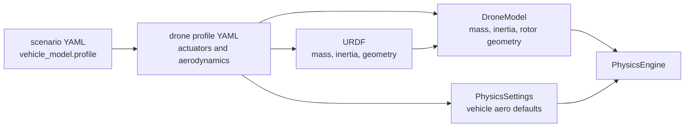
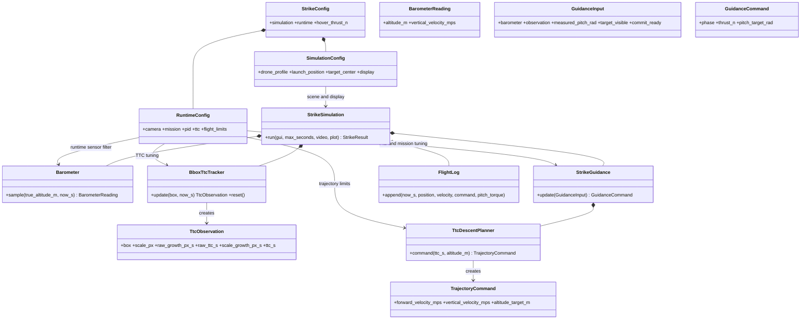
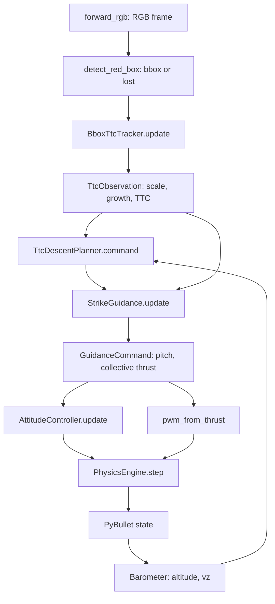
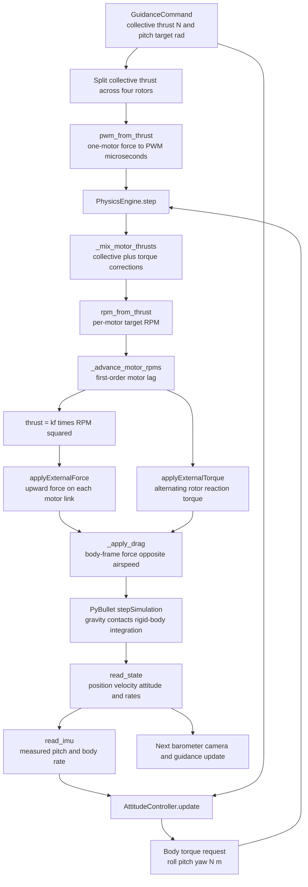
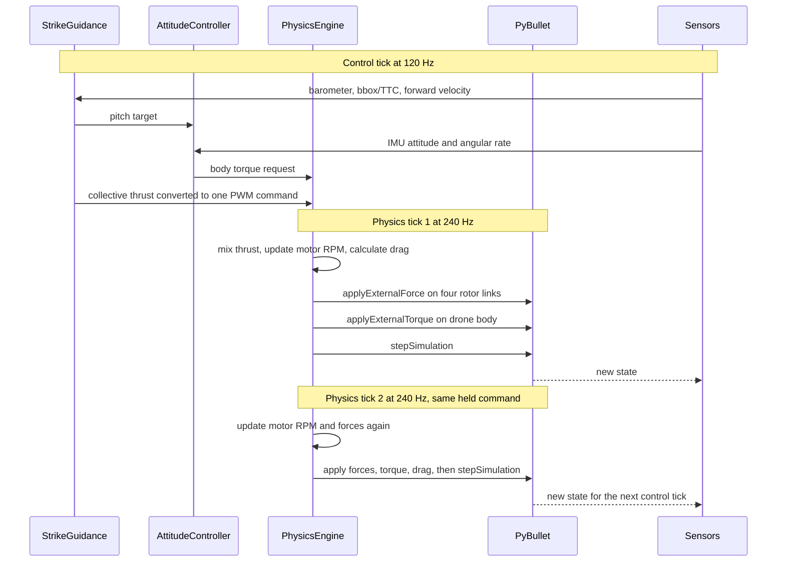
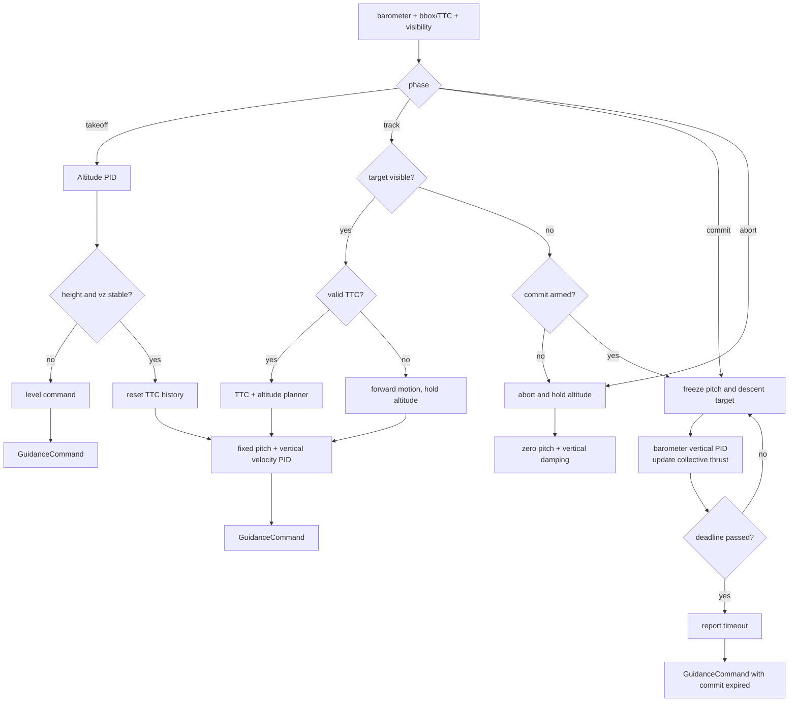

# TTC diagonal-strike package

Design and implementation plans are catalogued in the
[`design` index](design/README.md), including their implementation status and
commit when known.

This Module 7 proof of concept takes off to 15 m, detects a red cube, estimates
time-to-contact (TTC) from bounding-box growth, synchronises its descent to the
known impact altitude, and records the contact. The controller does **not** need
the cube's metric size, image centre, focal length, or world position. Those
values exist only in `SimulationConfig` so the simulator can spawn and draw a
target.
Roll and yaw remain zero in this first exercise.

Run it with:

```bash
uv run fly-smart
```

For the complete command, YAML, output, and troubleshooting guide, see
[`ttc_strike_usage.md`](../ttc_strike_usage.md).

### Scenario YAML

Initial conditions can be changed without editing Python. The sample
`config/scenario.yaml` groups simulator setup separately from field-tunable runtime
parameters:

```yaml
simulation:
  vehicle_model:
    profile: default
  scene:
    launch_position: [-5.25, 0.0, 0.05]
    target_center: [20.0, 0.0, 1.0]
runtime:
  mission:
    takeoff_altitude_m: 15.0
  ttc:
    commit_box_height_fraction: 0.1
```

Run it with:

```bash
uv run fly-smart \
  --config examples/07-optical-navigation/ttc_strike/config/scenario.yaml
```

For the shorter 30 m test, use
`examples/07-optical-navigation/ttc_strike_inputs/30m_diagonal_strike.yaml`:

```bash
uv run fly-smart \
  --config examples/07-optical-navigation/ttc_strike_inputs/30m_diagonal_strike.yaml
```

`box.position` changes only where the simulator spawns the visual target;
the controller still uses image measurements and TTC. The YAML does not
change the existing 1 m impact altitude. For a distant target, lower
`commit_box_height_fraction` so a small bbox can enter the commit phase before
leaving the camera view. The resolved values and source path are recorded in
each run's `settings.json`.

The complete commented schema is in
`examples/07-optical-navigation/ttc_strike_inputs/template.yaml`. The loader
creates `SimulationConfig` and `RuntimeConfig` independently, then composes
them into `StrikeConfig`; the simulator and controllers receive typed config,
not YAML parsing responsibilities.

### Drone profiles and physical ownership

One scenario can select a complete physical vehicle without copying motor or
frame values into every example:

```yaml
simulation:
  vehicle_model:
    profile: seven_inch_trainer
```

| Source | Owns | Do not duplicate here |
| --- | --- | --- |
| Vehicle URDF | Mass, inertia, centre of mass, body geometry, rotor locations | Motor capability and aerodynamic coefficients |
| `examples/common/drone_profiles/*.yaml` | URDF choice, motors, propellers, drag, damping, rotor parameters | Mass or inertia |
| TTC scenario YAML | Scene, wind, enabled force models, sensor noise, display, recording | Frame dimensions or motor constants |
| `runtime` YAML | Camera installation, mission targets, TTC policy, limits, PID gains | Vehicle hardware data |

The loader reads base-link mass, center of mass, inertia, and rotor locations
from the selected URDF. The same mass is used by PyBullet and for
`hover_thrust_n`, while the same rotor locations are used by PyBullet force
links and the mixer, so geometry cannot drift between physics and control.



| Profile setting | `default` | `seven_inch_trainer` | Effect |
| --- | ---: | ---: | --- |
| URDF mass | 0.65 kg | 1.50 kg | Sets weight and hover thrust. |
| Rotor joint locations | ±0.120 m | ±0.120 m | URDF lever arms convert unequal motor lift into roll/pitch torque. |
| Maximum RPM | 24,000 | 20,000 | Caps each motor's target rotational speed. |
| Maximum thrust per motor | 6.3765 N | 12.0 N | Sets PWM-to-thrust range and climb authority. |
| Motor time constant | 0.05 s | 0.07 s | Controls motor response delay. |
| Motor yaw signs | `[1, -1, -1, 1]` | `[1, -1, -1, 1]` | Alternates reaction torque so equal motor thrust does not yaw. |
| Rotor drag coefficient | 0.000002 | 0.000003 | Scales rotor-dependent drag opposite relative airflow. |
| Propeller diameter | 0.140 m | 0.1778 m (7 in) | Used by optional inflow, flapping, and ground-effect models. |
| Body drag area, x/y/z | 0.012 / 0.012 / 0.020 m² | 0.020 / 0.020 / 0.030 m² | Resists vehicle-relative airflow. |
| Angular damping, roll/pitch/yaw | 0.0012 / 0.0012 / 0.0020 N m/(rad/s) | 0.0018 / 0.0018 / 0.0030 N m/(rad/s) | Resists angular velocity. |
| Rotor inertia | 0.000005 kg m² | 0.000008 kg m² | Used by the optional gyroscopic-torque model. |

Run the seven-inch scene with:

```bash
uv run fly-smart \
  --config examples/07-optical-navigation/ttc_strike/config/seven_inch_trainer.yaml
```

The seven-inch profile has 48 N maximum collective thrust and needs 14.715 N
to hover: 3.679 N per motor. Its mass and motor dynamics differ from the
course vehicle, so treat the existing PID gains as a starting point and tune
them before comparing flight results.

## Module design

```text
fly_smart/
├── mission.py      production mission and controller configuration
├── sensing.py      sensor readings and vertical state fusion
├── ttc.py          BboxTtcTracker: bbox scale growth to TTC
├── trajectory.py   TtcDescentPlanner: TTC + altitude to vx/vz target
├── guidance.py     StrikeGuidance: takeoff, track, commit, abort
├── red_target_detector.py RGB frame to target bounding box
└── simulation/     PyBullet, Godot, synthetic sensors, telemetry, and CLI
```

Only `simulation/` knows PyBullet and the synthetic world. The core modules
receive plain typed data, which keeps TTC and trajectory math easy to test.

## Class relationships



| Class | Role |
| --- | --- |
| `SimulationConfig` | Simulator scene, vehicle model, synthetic sensors, display, and recording defaults. |
| `RuntimeConfig` | Physical camera setup, mission targets, TTC tuning, limits, filters, and PID gains. |
| `StrikeConfig` | Composes the two independent configuration groups. |
| `Barometer` | Samples altitude and filters vertical velocity. |
| `BboxTtcTracker` | Converts bbox scale growth into TTC and commit readiness. |
| `TtcObservation` | Typed visual measurement: box, scale, growth, and TTC. |
| `TtcDescentPlanner` | Uses TTC as time-to-go for the known impact altitude. |
| `StrikeGuidance` | Selects takeoff, track, commit, or abort and emits high-level commands. |
| `StrikeSimulation` | Connects sensing, guidance, motor helpers, rendering, and contact. |

## TTC and altitude math

The detector supplies only a rectangle. Let `s = sqrt(width_px * height_px)`.
The alpha-beta filter predicts scale and growth, measures the scale residual
`r = s_measured - (s_previous + g_previous dt)`, then corrects:

`s_estimated = s_predicted + alpha r`

`g_estimated = g_previous + beta r / dt`

Guidance receives `TTC = s_estimated / g_estimated` when estimated growth is
positive enough.

The telemetry view shows the dashed raw bbox growth and solid alpha-beta
estimated growth directly during tracking. This is easier to interpret than TTC because TTC
divides by growth and therefore explodes when growth is close to zero. Raw and
filtered TTC remain in the CSV for offline analysis; raw TTC is blank when raw
growth is zero or negative.

No target size or camera calibration is required. During tracking the planner
uses barometer altitude `h` and known impact altitude `h*`:

`v_z* = clamp((h* - h) / max(TTC, min_TTC), -max_descent, max_climb)`.

Before a valid TTC exists, the drone keeps nominal forward velocity and holds
altitude while moving forward to create measurable bbox growth.

## Configuration reference

`SimulationConfig.target_center` and `SimulationConfig.target_size_m` are
fixture values only; changing them must not change the controller equations.
`RuntimeConfig` contains the camera setup and values that should be calibrated
against a real vehicle.

| Field | Default | Meaning |
| --- | --- | --- |
| `takeoff_altitude_m` | `15.0` | Height at which tracking starts. |
| `takeoff_max_climb_velocity_mps` | `7.2` | Measured guard that limits physical climb speed to about 8 m/s. |
| `barometer.sample_hz` | `40.0` | BMP388 altitude update rate, independent of the camera. |
| `barometer.altitude_noise_sigma_m` | `0.10` | Full-bandwidth BMP388 RMS altitude noise. |
| `barometer.altitude_bias_m` | `0.0` | Constant takeoff-reference/calibration offset. |
| `barometer.drift_sigma_m_per_sqrt_s` | `0.0` | Optional seeded slow random-walk drift; zero disables it. |
| `barometer.altitude_old_weight` | `0.80` | Raw-altitude EMA memory before altitude control and velocity inference. |
| `barometer.velocity_old_weight` | `0.95` | Vertical-speed filter memory that suppresses noisy altitude differentiation. |
| `imu.accelerometer_noise_sigma_mps2` | `0.0075` | ICM-42688-P-inspired vertical acceleration noise. |
| `vertical_estimator.alpha/beta` | `0.08 / 0.005` | Barometer correction gains for fused height and vertical speed. |
| `impact_altitude_m` | `1.0` | Desired altitude at contact. |
| `forward_speed_mps` | `13.0` | Nominal body-forward command. |
| `nominal_pitch_deg` | `20.0` | Initial forward pitch while altitude is held. |
| `max_descent_velocity_mps` | `4.5` | Downward velocity limit used after TTC becomes valid. |
| `max_climb_velocity_mps` | `3.0` | Upward velocity limit. |
| `camera_fov_deg` | `90.0` | Rendering FOV only; not a TTC range scale. |
| `commit_box_height_fraction` | `0.1` | Image-height threshold that arms commit. |
| `ttc.alpha` | `0.85` | Trust in each measured bbox scale. |
| `ttc.beta` | `0.05` | Trust in the scale-rate correction. |
| `min_growth_px_per_s` | `0.01` | Rejects zero/negative approach growth. |
| `commit_timeout_margin_s` | `5.0` | Extra time after the last TTC during commit. |
| `post_impact_seconds` | `3.0` | Passive physics/video time after contact; telemetry freezes at contact. |

`pitch_attitude_pid_gains` is tuned for this strike example as
`(0.008, 0.0, 0.006)`. It is separate from the shared attitude defaults used
by the other examples. Collective thrust uses measured pitch so attitude lag
does not silently remove vertical lift.

`forward_speed_pid_gains` controls the pitch response that tracks the forward
velocity target; `max_pitch_deg` limits the requested tilt.

During takeoff, the default altitude PID uses `(1.8, 0.05, 2.2)` for faster
launch and braking. When measured climb speed reaches
`takeoff_max_climb_velocity_mps`, collective thrust is capped at hover thrust;
tracking still waits for the normal altitude and vertical-speed settled
conditions.

The barometer's `0.10 m` sample noise comes from the BMP388 full-bandwidth
`1.2 Pa` datasheet figure. Its larger accuracy specifications describe
calibration and temperature effects, so they are represented by a fixed bias
or optional slow drift rather than fresh noise every sample. The default
`velocity_old_weight: 0.95` is necessary because differentiated 40 Hz altitude
noise would otherwise look like several metres per second of vertical motion.
Prop wash is not
yet modeled. The remaining fields tune mass/gravity, PID gains, window
placement, video resolution, and output paths. Contact is the headless success
condition; impact speed is reported for analysis rather than used as a hidden
pass/fail gate.

The final telemetry subplot appears after the alpha-beta bbox-growth graph. It
compares raw BMP388 altitude, EMA-filtered altitude used by guidance, and the
true PyBullet altitude. Existing runs can be analysed without rerunning
PyBullet:

```bash
uv run python examples/07-optical-navigation/plot_barometer_csv.py \
  outputs/ttc_runs/your-run
```

The command reads the run's `telemetry.csv` and `settings.json`, recreates the
seeded sensor stream, and writes `telemetry_barometer.png` beside them. This
offline plot is analysis-only for historical runs.

Every run creates a unique folder under `outputs/ttc_runs/` containing
`settings.json`, `telemetry.csv`, and `telemetry.png` (plus `environment.mp4`
unless disabled). Use `--run-name name` for a readable folder or `--output-root`
to select another comparison directory. Use `--csv path` or `--no-csv`; columns include phase, measured position/velocity,
trajectory velocity targets, altitude target, thrust, commanded/measured pitch,
pitch error, and pitch torque. This makes the initial forward-pitch/altitude-
hold interval easy to inspect before tuning.

The same folder contains `summary.json` and the console prints its key values:
starting pose, target pose and size, collision time and position, incoming
hitting velocity, impact speed, altitude extrema, and maximum forward speed.
The velocity and guidance plots shade the tracking interval only up to the
collision marker. The `TrajectoryCommand` plot is intentionally left unshaded
so its command curves remain easy to read.

### Physical-force configuration

The shared `PhysicsEngine` now receives the scenario's
`simulation.physical_forces` block. Frame drag, angular damping, and a
constant world-frame wind model are enabled by default; wind starts at
`[0, 0, 0] m/s`. Rotor inflow/blade flapping, ground effect, and gyroscopic
torque are implemented as optional effects and default to off.

Use the commented [`template.yaml`](../ttc_strike_inputs/template.yaml) to
change coefficients. The run CSV records applied body drag, pitch damping,
gyroscopic pitch torque, and maximum ground-effect multiplier. See
[`design/physics/missing_flight_forces_plan.md`](../../../design/physics/missing_flight_forces_plan.md)
for the equations, ownership boundary, and tuning order.

The vehicle profile supplies the default drag area, angular-damping
coefficients, propeller diameter, and rotor inertia. A scenario may override
those values in `simulation.physical_forces` for a controlled experiment, but
the profile is the normal place to change them when the real vehicle changes.

## TTC-to-drone-step flow



`commit` holds the last valid pitch and corrected descent-rate target until
contact or its TTC deadline. The barometer-driven vertical PID still updates
collective thrust, so a fixed command cannot turn a terminal descent into a
climb. After contact, thrust and torque are set to zero for the configured
aftermath window. The wide PyBullet camera is only a scene view; the controller
uses the body-fixed forward camera.

## Low-level control and physics loop

`StrikeGuidance` does not call PyBullet directly. It publishes a small,
physical command at the 120 Hz control rate:

- `thrust_n` is the **total requested lift in newtons** for all four motors.
- `pitch_target_rad` is the desired body pitch. Positive pitch tilts the rotor
  disk and creates forward acceleration.

`StrikeSimulation` adapts that command to the shared controller and physics
engine. The engine runs every 240 Hz physics tick, so it continues to model
motor response and forces between control updates. Gravity and collision are
handled by PyBullet when `stepSimulation()` advances the rigid body.



The arrows labelled `applyExternalForce` and `applyExternalTorque` are the
boundary where the course's motor model becomes PyBullet physics. A rotor
force is applied in its own link frame along body `+Z`; tilting the drone
therefore tilts the total lift vector forward. Equal motor thrust mainly
changes lift. Unequal thrust creates roll or pitch torque through the arm
length, while alternating rotor spin creates yaw torque.

### One control period and two physics ticks

The default clocks are `control_hz = 120` and `physics_hz = 240`. The control
command is held for two physics ticks; this is intentional, not a skipped
controller update.



### What each layer owns

| Layer | Code | Input | Output | Responsibility |
| --- | --- | --- | --- | --- |
| Guidance | `StrikeGuidance.update()` | TTC, barometer, forward speed | `GuidanceCommand` | Select phase, collective thrust, and desired pitch. |
| Attitude loop | `AttitudeController.update()` | desired pitch, IMU attitude/rates | `(roll, pitch, yaw)` torque in N m | Correct the difference between desired and measured attitude. |
| Command adapter | `StrikeSimulation.run()` | collective thrust and torque | one PWM value plus torque | Divides collective force by four and keeps control/physics clocks coordinated. |
| Mixer and motors | `PhysicsEngine.step()` | PWM and torque | four actual RPM values | Mixes torque corrections, limits motors, and models motor lag. |
| Force model | `PhysicsEngine` force helpers | RPM, body-relative airspeed, and rates | PyBullet external forces/torques | Applies thrust, drag, damping, and optional advanced effects. |
| Rigid-body simulator | `pybullet.stepSimulation()` | forces, torque, gravity, contacts | next pose and velocity | Integrates motion and resolves collision with the target/scene. |

For one rotor, the simplified actuator chain is:

```text
requested force -> PWM -> target RPM -> delayed actual RPM -> thrust
F_rotor = kf * RPM^2
```

The total lift is the sum of the four rotor thrusts. `GuidanceCommand.thrust_n`
is divided by four before conversion to PWM, then the mixer adds small
per-motor corrections for the requested attitude torque. The resulting total
thrust can differ briefly from the guidance request because motors have a
time constant and because individual motor limits are enforced.

`PhysicsStep` records the applied PWM, four RPM values, four thrusts, total
thrust, drag force, and the resulting state. The force arrows in the PyBullet
GUI are drawn from that result; they show the actual applied rotor forces, not
the requested command.

## `StrikeGuidance.update()` phase flow


