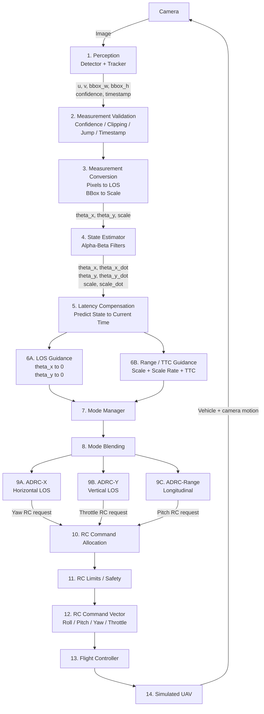
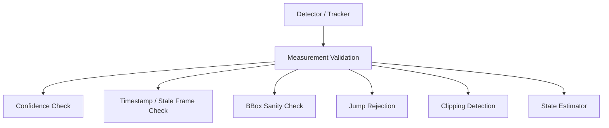
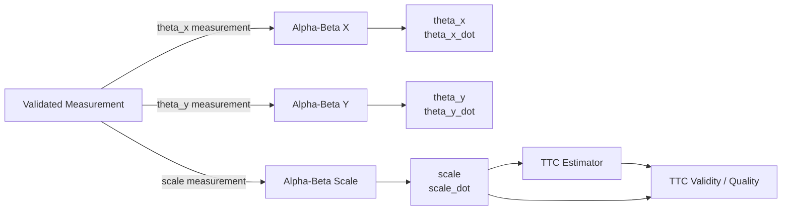
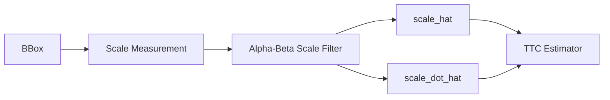
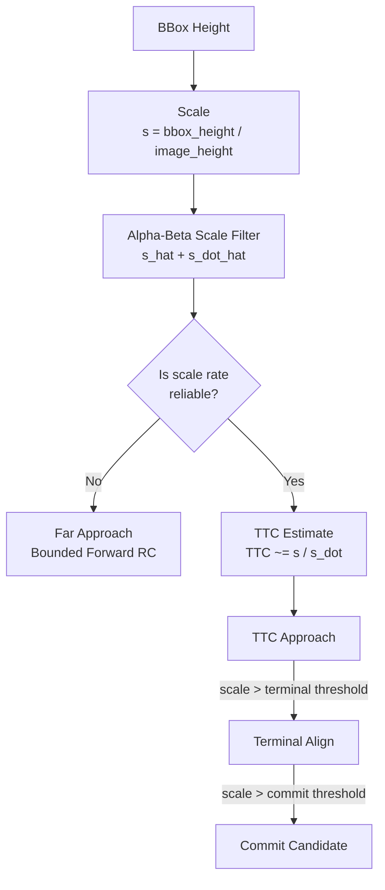
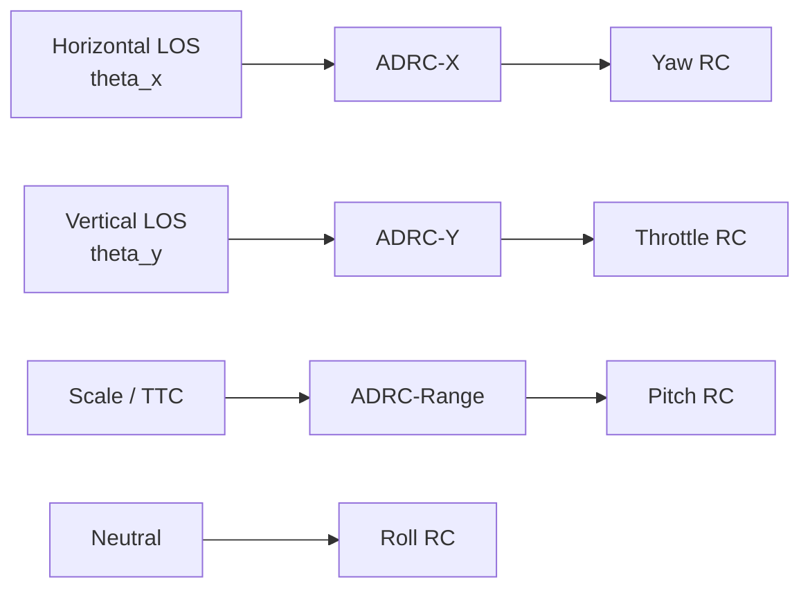
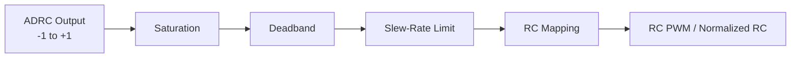
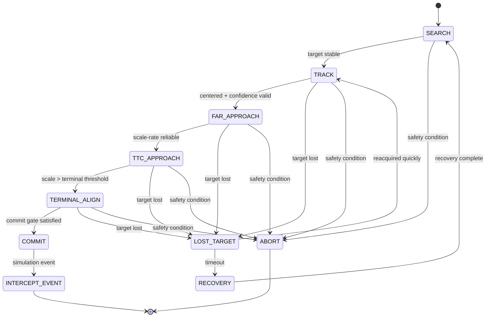
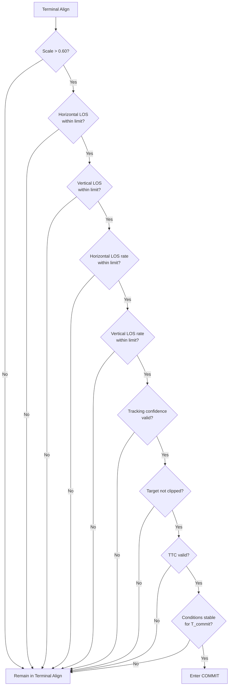

# ADRC-Based Drone Visual Tracking System
## Simulation Design Document

## 1. Purpose and Scope

This document defines the current architecture for a simulated drone visual-tracking system based on ADRC.

The system should:

1. Detect and track a target.
2. Center the target in the camera.
3. Approach the target using apparent target scale and TTC-related cues.
4. Enter a terminal-alignment phase.
5. Enter a simulation-only COMMIT phase when predefined geometric and tracking conditions are satisfied.
6. Output RC-equivalent commands from the ADRC layer rather than velocity references.

The architecture separates:

- perception,
- measurement validation,
- visual-state estimation,
- latency compensation,
- guidance,
- mode management,
- ADRC control,
- RC command allocation,
- FCU stabilization,
- safety logic,
- logging and simulation instrumentation.

---

## 2. High-Level Architecture



---

## 3. Perception Output

The detector/tracker provides:

```text
u
v
bbox_width
bbox_height
confidence
timestamp
```

Where:

- `u, v` = target bounding-box center.
- `bbox_width` = bounding-box width in pixels.
- `bbox_height` = bounding-box height in pixels.
- `confidence` = detector/tracker confidence.
- `timestamp` = measurement time.

Camera parameters:

```text
image_width  = W
image_height = H

principal point = (cx, cy)

focal lengths:
fx
fy
```

---

## 4. Measurement Conversion

### 4.1 Pixel Error

```text
ex = u - cx
ey = v - cy
```

Normalized image error:

```text
ex_norm = (u - cx) / (W / 2)
ey_norm = (v - cy) / (H / 2)
```

### 4.2 Line-of-Sight Angles

Prefer angular LOS measurements over raw pixels:

```text
theta_x = atan((u - cx) / fx)
theta_y = atan((v - cy) / fy)
```

Tracking objective:

```text
theta_x -> 0
theta_y -> 0
```

---

## 5. Target Scale

Use apparent bounding-box size as a monocular range proxy.

Recommended primary scale:

```text
scale = bbox_height / image_height
```

Optional additional measures:

```text
scale_width = bbox_width / image_width

scale_area =
    (bbox_width * bbox_height)
    /
    (image_width * image_height)
```

For the first implementation, use bbox height ratio as the main scale variable.

---

## 6. Measurement Validation

Raw detector output should not directly enter the estimator.



Recommended checks:

```text
confidence > confidence_min

timestamp > previous_timestamp

bbox_width > 0
bbox_height > 0
```

Also reject physically unreasonable jumps in:

```text
u
v
bbox_width
bbox_height
```

---

## 7. Target Clipping

A target touching the image boundary can make scale unreliable.

```text
target_clipped =
    bbox_left   <= margin
    OR
    bbox_right  >= W - margin
    OR
    bbox_top    <= margin
    OR
    bbox_bottom >= H - margin
```

If:

```text
target_clipped = true
```

then scale quality should be reduced or the scale measurement rejected.

---

## 8. State Estimator

The visual state is:

```text
theta_x
theta_x_dot

theta_y
theta_y_dot

scale
scale_dot
```

Estimator quality outputs:

```text
LOS_quality
scale_quality
measurement_age
prediction_age
```

### Estimator Diagram



---

## 9. Recommended Filter

Use three independent alpha-beta filters:

```text
Alpha-Beta X
    theta_x
    theta_x_dot

Alpha-Beta Y
    theta_y
    theta_y_dot

Alpha-Beta Scale
    scale
    scale_dot
```

Advantages:

- simple,
- lightweight,
- easy to tune,
- provides both state and rate estimates,
- appropriate for the first simulation implementation.

A Kalman filter may be considered later if IMU, optical flow, range sensors, or explicit uncertainty fusion are added.

---

## 10. Alpha-Beta Filter Equations

For generic state `x`, rate `v`, measurement `z`, and timestep `dt`:

Prediction:

```text
x_pred = x_prev + dt * v_prev
```

Residual:

```text
r = z - x_pred
```

State update:

```text
x_new = x_pred + alpha * r
```

Rate update:

```text
v_new = v_prev + (beta / dt) * r
```

Apply independently to:

```text
theta_x
theta_y
scale
```

---

## 11. Scale Filtering

Do not estimate scale rate directly from raw bbox differences:

```text
scale_dot =
    (scale_now - scale_previous)
    /
    dt
```

Instead use:



This reduces noise amplification from detector jitter.

---

## 12. Latency Compensation

The detector output may be delayed relative to the current control time.

```text
latency =
    current_time
    -
    measurement_timestamp
```

Predict the state to the current time:

```text
theta_x_now =
    theta_x_hat
    +
    theta_x_dot_hat * latency
```

```text
theta_y_now =
    theta_y_hat
    +
    theta_y_dot_hat * latency
```

```text
scale_now =
    scale_hat
    +
    scale_dot_hat * latency
```

Latency compensation becomes especially important during fast terminal motion.

---

## 13. TTC Estimate

Using filtered scale and scale rate:

```text
s = scale_hat
s_dot = scale_dot_hat
```

TTC-like estimate:

```text
TTC ~= s / s_dot
```

Use only when scale rate is sufficiently large and has the expected sign.

---

## 14. TTC Validity

If:

```text
abs(scale_dot_hat) < scale_dot_min
```

then:

```text
TTC_valid = false
```

Additional validity checks:

```text
scale_quality is good
target_clipped == false
measurement_age < maximum_age
confidence > confidence_min
scale_dot stable for several frames
```

Recommended outputs:

```text
TTC
TTC_valid
TTC_quality
```

---

## 15. Why TTC Is Not Enough

When the target is far away:

```text
scale is small
scale_dot ~= 0
```

TTC becomes very large or unstable.

Therefore range guidance should use:

```text
scale
+
scale_dot
+
TTC validity
```

rather than TTC alone.

---

## 16. Range / TTC Logic



---

## 17. ADRC Control Channels

Use three ADRC channels:

```text
ADRC-X
ADRC-Y
ADRC-RANGE
```

### ADRC-X

Purpose:

```text
Horizontal target alignment
```

Error:

```text
error_x =
    theta_x_ref
    -
    theta_x_hat
```

Output:

```text
normalized yaw RC command
```

### ADRC-Y

Purpose:

```text
Vertical target alignment
```

Error:

```text
error_y =
    theta_y_ref
    -
    theta_y_hat
```

Output:

```text
normalized throttle RC command
```

The throttle command is interpreted as an offset around hover throttle.

### ADRC-RANGE

Purpose:

```text
Longitudinal approach control
```

Inputs may include:

```text
scale
scale_dot
TTC
TTC_valid
current_mode
```

Output:

```text
normalized pitch RC command
```

---

## 18. RC Mapping

Initial mapping:



Initial policy:

```text
Horizontal LOS -> Yaw RC
Vertical LOS   -> Throttle RC
Range / TTC    -> Pitch RC
Roll RC        -> Neutral
```

This avoids using pitch for two different outer-loop objectives.

---

## 19. Normalized ADRC Outputs

Keep ADRC internally independent of PWM or simulator-specific RC units.

Recommended normalized output:

```text
u in [-1, +1]
```

For centered channels such as roll, pitch, and yaw:

```text
RC =
    RC_mid
    +
    u * RC_range
```

Conceptually:

```text
u = -1 -> full negative command
u =  0 -> neutral
u = +1 -> full positive command
```

The RC mapping layer converts normalized output into whatever the simulator or FCU expects.

---

## 20. Throttle Mapping

Throttle differs from centered control channels.

Interpret ADRC-Y output as an offset around hover throttle:

```text
throttle_RC =
    hover_throttle_RC
    +
    ADRC_Y_output * throttle_range
```

Therefore:

```text
ADRC_Y_output = 0
```

means nominal hover throttle rather than minimum throttle.

---

## 21. RC Output Conditioning



Apply:

- saturation,
- deadband where appropriate,
- slew-rate limiting,
- per-channel RC scaling,
- mode-specific limits.

---

## 22. Visual Estimator vs ADRC ESO

These remain separate.

Visual estimator handles:

```text
camera noise
detector jitter
target motion
missing measurements
latency
scale-rate estimation
```

ADRC ESO handles:

```text
vehicle dynamics
plant uncertainty
external disturbances
controller-model mismatch
coupling
```

They are complementary.

---

## 23. Mode Manager

Main sequence:



Optional development mode:

```text
RANGE_HOLD
```

---

## 24. SEARCH Mode

Purpose:

```text
Acquire a valid target
```

Transition:

```text
SEARCH
  -> target detected consistently
TRACK
```

---

## 25. TRACK Mode

Purpose:

```text
Center the target
```

Objectives:

```text
theta_x -> 0
theta_y -> 0
```

Transition to FAR_APPROACH when:

```text
target stable
AND
target approximately centered
AND
confidence acceptable
```

---

## 26. FAR APPROACH Mode

Used when:

```text
target is far
scale is small
scale_dot ~= 0
TTC invalid
```

Behavior:

```text
continue LOS tracking
+
apply bounded forward pitch RC command
```

Conceptually:

```text
if target_centered
and target_valid
and TTC_valid == false:
    command bounded forward pitch RC
```

---

## 27. TTC APPROACH Mode

Enter when:

```text
scale_dot measurable
AND
TTC valid
```

Behavior:

```text
maintain LOS alignment
monitor scale growth
monitor TTC
adjust forward pitch RC
```

---

## 28. Optional RANGE HOLD Mode

Useful for development and controller validation.

Objective:

```text
scale -> desired_scale
```

Example:

```text
scale_error =
    desired_scale
    -
    scale_hat
```

---

## 29. TERMINAL ALIGN Mode

Purpose:

```text
reduce LOS error
reduce LOS rate
ensure stable tracking
verify scale estimate
prepare for COMMIT
```

Initial transition proposal:

```text
scale > 0.45
```

This threshold remains configurable.

---

## 30. COMMIT Gate

Initial scale trigger:

```text
scale = bbox_height / image_height
```

Scale condition:

```text
scale > 0.60
```

This is only one part of the gate.

Recommended full gate:

```text
COMMIT_ALLOWED =
    scale_large
    AND horizontal_alignment_good
    AND vertical_alignment_good
    AND horizontal_LOS_rate_good
    AND vertical_LOS_rate_good
    AND tracker_stable
    AND target_not_clipped
    AND measurements_valid
    AND TTC_valid
```

### Commit Gate Diagram



---

## 31. Why LOS Rate Matters

A target may briefly cross the image center while moving rapidly across the camera.

Therefore:

```text
small LOS error
```

is insufficient.

A stronger terminal condition is:

```text
small LOS error
+
small LOS rate
```

---

## 32. Persistence

Do not enter COMMIT because of one noisy frame.

Use either:

```text
COMMIT conditions true
for N consecutive frames
```

or preferably:

```text
COMMIT conditions true
for T_commit seconds
```

Initial simulation range:

```text
T_commit = 0.1 to 0.2 s
```

Keep this configurable.

---

## 33. Hysteresis

Use different entry and cancel thresholds.

Example:

```text
ENTER COMMIT candidate:
    scale > 0.60

CANCEL COMMIT candidate:
    scale < 0.50
```

This prevents mode oscillation caused by bbox noise.

---

## 34. COMMIT Phase

Before COMMIT, range control may use scale or TTC regulation.

During COMMIT, range-hold behavior is disabled.

Simulation terminal priorities:

```text
1. Maintain horizontal LOS alignment.
2. Maintain vertical LOS alignment.
3. Keep LOS rates small.
4. Continue the simulated closing trajectory.
```

---

## 35. Lost Target Handling

Possible loss conditions:

```text
confidence too low
bbox disappeared
frame stale
target exits FOV
prediction_age too large
```

Suggested behavior:

```text
tracking
   ->
brief loss
   ->
prediction-only grace period
   ->
target recovered?
   yes -> resume
   no  -> LOST_TARGET
           ->
         RECOVERY
           ->
         SEARCH
```

---

## 36. Prediction-Only Grace Period

During a short measurement loss, use predicted values:

```text
theta_x_hat
theta_x_dot_hat
theta_y_hat
theta_y_dot_hat
scale_hat
scale_dot_hat
```

Monitor:

```text
prediction_age
```

If:

```text
prediction_age > max_prediction_age
```

then:

```text
estimator_valid = false
```

and active approach/terminal modes should be exited.

---

## 37. Mode Blending

Avoid abrupt output changes between modes.

Use command blending:

```text
command =
    (1 - lambda) * old_command
    +
    lambda * new_command
```

with:

```text
0 <= lambda <= 1
```

Useful transitions:

```text
TRACK -> FAR_APPROACH
FAR_APPROACH -> TTC_APPROACH
TTC_APPROACH -> TERMINAL_ALIGN
```

---

## 38. RC Command Allocation

Preferred initial allocation:

```text
Yaw RC      <- ADRC-X
Throttle RC <- ADRC-Y
Pitch RC    <- ADRC-Range
Roll RC     <- Neutral
```

The command allocator is responsible for:

- mapping normalized ADRC outputs to RC channels,
- channel sign conventions,
- simulator/FCU-specific RC range,
- hover throttle offset,
- mode-specific limits.

---

## 39. Flight Controller Responsibilities

The ADRC layer does not directly control simulated motors.

The FCU receives RC commands and remains responsible for:

```text
attitude stabilization
angular-rate control
altitude response
motor mixing
vehicle dynamics
```

Control chain:

```text
Visual ADRC
    ->
Normalized RC Commands
    ->
RC Mapping / Limits
    ->
Flight Controller
    ->
Simulated UAV
```

---

## 40. Software Interfaces

### PerceptionOutput

```text
timestamp
target_valid

center_x
center_y

bbox_width
bbox_height

confidence
```

### MeasurementState

```text
timestamp

theta_x_meas
theta_y_meas

scale_meas

target_clipped
measurement_valid
```

### EstimatedTargetState

```text
timestamp

theta_x
theta_x_dot

theta_y
theta_y_dot

scale
scale_dot

LOS_quality
scale_quality

measurement_age
prediction_age
```

### RangeState

```text
scale
scale_dot

TTC
TTC_valid
TTC_quality
```

### GuidanceState

```text
mode

theta_x_ref
theta_y_ref

range_reference
commit_candidate
```

### ControllerOutput

```text
yaw_rc_normalized
throttle_rc_normalized
pitch_rc_normalized
roll_rc_normalized
```

---

## 41. Logging

Log at minimum:

```text
timestamp
mode

raw_u
raw_v

raw_bbox_width
raw_bbox_height

confidence

theta_x_measured
theta_y_measured
scale_measured

theta_x_estimated
theta_x_dot_estimated

theta_y_estimated
theta_y_dot_estimated

scale_estimated
scale_dot_estimated

TTC
TTC_valid

ADRC_X_output
ADRC_Y_output
ADRC_RANGE_output

roll_rc
pitch_rc
yaw_rc
throttle_rc

vehicle_attitude
vehicle_velocity
vehicle_position

measurement_latency
prediction_age

target_clipped
```

---

## 42. Recommended Simulation Plots

```text
theta_x vs time
theta_y vs time

theta_x_dot vs time
theta_y_dot vs time

scale vs time
scale_dot vs time

TTC vs time

ADRC outputs vs time

RC commands vs time

mode vs time

confidence vs time

measurement latency vs time
```

---

## 43. Main Configurable Parameters

```text
confidence_min

alpha_x
beta_x

alpha_y
beta_y

alpha_scale
beta_scale

scale_dot_min

track_center_threshold_x
track_center_threshold_y

terminal_scale_threshold

commit_scale_threshold

commit_theta_x_max
commit_theta_y_max

commit_theta_x_dot_max
commit_theta_y_dot_max

commit_confidence_min

commit_persistence_time

commit_enter_scale
commit_cancel_scale

max_measurement_age
max_prediction_age

target_loss_timeout

max_yaw_rc
max_pitch_rc
max_throttle_delta
max_roll_rc

rc_deadband
rc_slew_rate

hover_throttle_rc
```

---

## 44. Initial Scale Regions

Initial simulation starting points only:

```text
scale < 0.15
    FAR region

0.15 <= scale < 0.45
    TTC APPROACH region

0.45 <= scale < 0.60
    TERMINAL ALIGN region

scale >= 0.60
    COMMIT scale condition
```

These thresholds depend on:

- camera FOV,
- target size,
- target geometry,
- detector behavior,
- UAV dynamics,
- approach speed.

---

## 45. Recommended Development Order

### Stage 1

```text
Detector
 ->
LOS Conversion
 ->
Alpha-Beta Estimator
 ->
Logging / Plots
```

Validate:

```text
theta_x
theta_y
theta_x_dot
theta_y_dot
```

### Stage 2

Add:

```text
ADRC-X
ADRC-Y
```

Validate target centering with RC yaw and throttle outputs.

### Stage 3

Add:

```text
bbox
 ->
scale
 ->
alpha-beta filter
 ->
scale_dot
```

### Stage 4

Add:

```text
TTC estimation
TTC validity
```

### Stage 5

Add:

```text
FAR_APPROACH
```

with bounded pitch RC.

### Stage 6

Add:

```text
TTC_APPROACH
```

### Stage 7

Add:

```text
TERMINAL_ALIGN
```

### Stage 8

Add simulation-only:

```text
COMMIT
```

using:

```text
scale
LOS error
LOS rate
confidence
clipping
TTC validity
persistence
```

### Stage 9

Add:

```text
lost-target recovery
mode blending
latency compensation
```

### Stage 10

Tune estimator, ADRC parameters, RC scaling, and state-machine thresholds through repeated simulation runs.

---

## 46. Final Design Summary

Main visual state groups:

```text
Horizontal LOS:
    theta_x
    theta_x_dot

Vertical LOS:
    theta_y
    theta_y_dot

Range proxy:
    scale
    scale_dot
    TTC
```

Main controller mapping:

```text
theta_x
    ->
ADRC-X
    ->
Yaw RC

theta_y
    ->
ADRC-Y
    ->
Throttle RC

scale + scale_dot + TTC
    ->
ADRC-RANGE
    ->
Pitch RC

Roll RC
    ->
Neutral initially
```

Main mode sequence:

```text
SEARCH
   ->
TRACK
   ->
FAR_APPROACH
   ->
TTC_APPROACH
   ->
TERMINAL_ALIGN
   ->
COMMIT
   ->
SIMULATION INTERCEPT EVENT
```

The initial COMMIT scale condition is:

```text
bbox_height / image_height > 0.60
```

but COMMIT also requires:

```text
small horizontal LOS error
small vertical LOS error

small horizontal LOS rate
small vertical LOS rate

stable tracker confidence
valid estimator
valid TTC
target not clipped
persistence for a configured period
```

This design provides a clean separation between perception, estimation, guidance, ADRC regulation, RC command generation, flight-controller stabilization, mode management, and simulation instrumentation.
