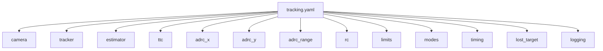
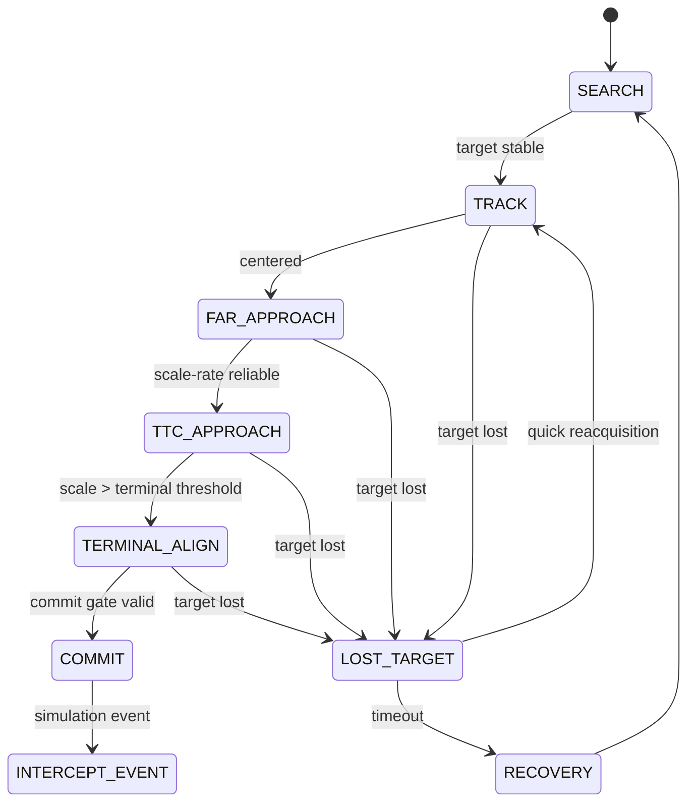
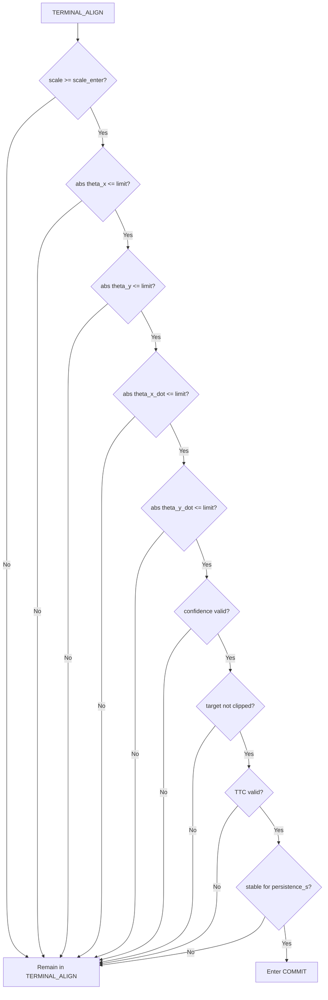
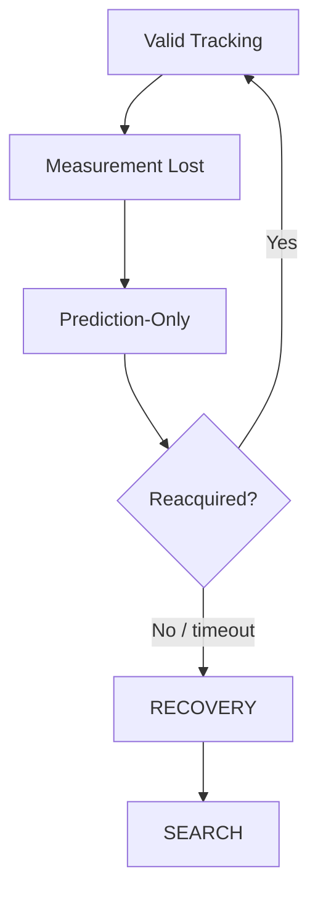
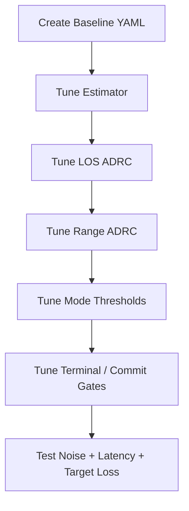

# ADRC Drone Tracking Parameter File Design
## YAML Configuration Specification

## 1. Purpose

This document defines the YAML configuration file used by the ADRC-based drone visual-tracking simulation.

The configuration file centralizes all tunable parameters for:

- camera geometry,
- perception and tracker validation,
- visual-state estimation,
- TTC estimation,
- ADRC controllers,
- RC command mapping,
- command limits,
- mode transitions,
- COMMIT gating,
- lost-target recovery,
- timing,
- logging.

The main goal is to allow controller and state-machine tuning without modifying source code.

---

# 2. Recommended File Name

```text
config/tracking.yaml
```

Recommended project layout:

```text
project/
├── config/
│   └── tracking.yaml
├── src/
│   ├── perception/
│   ├── estimation/
│   ├── guidance/
│   ├── control/
│   └── simulation/
└── logs/
```

---

# 3. Configuration Structure



Recommended top-level sections:

```yaml
camera:
tracker:
estimator:
ttc:

adrc_x:
adrc_y:
adrc_range:

rc:
limits:

modes:
timing:
lost_target:
logging:
```

---

# 4. Design Principles

The configuration should follow these rules:

1. Parameters must have explicit units where applicable.
2. Normalized values should preferably be in the range `[-1, 1]` or `[0, 1]`.
3. Time parameters should use seconds.
4. Angular parameters should use radians internally.
5. Pixel values should only be used where camera-space geometry requires them.
6. Mode thresholds should never be hard-coded in controller logic.
7. RC hardware/simulator values should be separated from normalized ADRC outputs.
8. Safety limits should be configurable independently from controller gains.

---

# 5. Camera Parameters

The camera section defines image geometry required for conversion from image pixels to LOS angles.

```yaml
camera:
  image_width_px: 1280
  image_height_px: 720

  fx_px: 900.0
  fy_px: 900.0

  cx_px: 640.0
  cy_px: 360.0
```

## Parameters

| Parameter | Type | Unit | Description |
|---|---|---|---|
| `image_width_px` | int | px | Camera image width |
| `image_height_px` | int | px | Camera image height |
| `fx_px` | float | px | Horizontal focal length |
| `fy_px` | float | px | Vertical focal length |
| `cx_px` | float | px | Principal point X |
| `cy_px` | float | px | Principal point Y |

LOS conversion:

```text
theta_x = atan((u - cx_px) / fx_px)
theta_y = atan((v - cy_px) / fy_px)
```

Validation:

```text
image_width_px > 0
image_height_px > 0

fx_px > 0
fy_px > 0

0 <= cx_px <= image_width_px
0 <= cy_px <= image_height_px
```

---

# 6. Tracker and Measurement Validation

```yaml
tracker:
  confidence_min: 0.50

  bbox_margin_px: 5

  max_center_jump_norm: 0.25
  max_scale_jump: 0.20

  max_measurement_age_s: 0.10

  required_valid_frames: 3
```

## Parameters

| Parameter | Unit | Description |
|---|---|---|
| `confidence_min` | normalized | Minimum accepted tracker confidence |
| `bbox_margin_px` | px | Margin used to detect target clipping |
| `max_center_jump_norm` | normalized image | Maximum accepted target-center jump |
| `max_scale_jump` | normalized scale | Maximum accepted single-frame scale jump |
| `max_measurement_age_s` | s | Maximum age for a measurement |
| `required_valid_frames` | frames | Consecutive valid detections required before considering target stable |

Target clipping:

```text
target_clipped =
    bbox_left   <= bbox_margin_px
    OR
    bbox_right  >= image_width_px - bbox_margin_px
    OR
    bbox_top    <= bbox_margin_px
    OR
    bbox_bottom >= image_height_px - bbox_margin_px
```

---

# 7. State Estimator Parameters

The first design uses three independent alpha-beta filters:

```text
theta_x       -> Alpha-Beta X
theta_y       -> Alpha-Beta Y
scale         -> Alpha-Beta Scale
```

Configuration:

```yaml
estimator:
  x:
    alpha: 0.70
    beta: 0.10

  y:
    alpha: 0.70
    beta: 0.10

  scale:
    alpha: 0.60
    beta: 0.08

  max_prediction_age_s: 0.20
```

## Parameters

| Parameter | Description |
|---|---|
| `x.alpha` | Horizontal LOS measurement correction gain |
| `x.beta` | Horizontal LOS-rate correction gain |
| `y.alpha` | Vertical LOS measurement correction gain |
| `y.beta` | Vertical LOS-rate correction gain |
| `scale.alpha` | Target-scale correction gain |
| `scale.beta` | Scale-rate correction gain |
| `max_prediction_age_s` | Maximum duration estimator may run without a new measurement |

Recommended validation:

```text
0 < alpha <= 1
0 <= beta <= 1

max_prediction_age_s > 0
```

---

# 8. TTC Parameters

```yaml
ttc:
  scale_dot_min: 0.005

  min_scale_quality: 0.70

  stable_time_s: 0.10

  min_ttc_s: 0.05
  max_ttc_s: 30.0
```

## TTC Calculation

```text
TTC ~= scale / scale_dot
```

Only when:

```text
abs(scale_dot) >= scale_dot_min
```

and all validity gates pass.

## Parameters

| Parameter | Unit | Description |
|---|---|---|
| `scale_dot_min` | 1/s | Minimum scale rate needed for valid TTC |
| `min_scale_quality` | normalized | Minimum accepted scale-estimator quality |
| `stable_time_s` | s | Required stable scale-rate duration |
| `min_ttc_s` | s | Minimum accepted TTC value |
| `max_ttc_s` | s | Maximum accepted TTC value |

TTC validity:

```text
TTC_valid =
    abs(scale_dot) >= scale_dot_min
    AND scale_quality >= min_scale_quality
    AND target_clipped == false
    AND measurement_valid == true
    AND scale_dot stable for stable_time_s
```

---

# 9. ADRC-X Parameters

ADRC-X controls horizontal LOS error.

Mapping:

```text
theta_x
   ->
ADRC-X
   ->
Yaw RC
```

Configuration:

```yaml
adrc_x:
  enabled: true

  b0: 1.0

  controller_bandwidth: 4.0
  observer_bandwidth: 12.0

  output_min: -1.0
  output_max: 1.0
```

## Meaning

| Parameter | Description |
|---|---|
| `enabled` | Enables horizontal ADRC |
| `b0` | Nominal plant input gain |
| `controller_bandwidth` | ADRC feedback bandwidth |
| `observer_bandwidth` | ESO bandwidth |
| `output_min` | Minimum normalized yaw command |
| `output_max` | Maximum normalized yaw command |

Output:

```text
yaw_rc_normalized in [-1, +1]
```

---

# 10. ADRC-Y Parameters

ADRC-Y controls vertical LOS error.

Mapping:

```text
theta_y
   ->
ADRC-Y
   ->
Throttle RC offset
```

Configuration:

```yaml
adrc_y:
  enabled: true

  b0: 1.0

  controller_bandwidth: 4.0
  observer_bandwidth: 12.0

  output_min: -1.0
  output_max: 1.0
```

Output:

```text
throttle_delta_normalized in [-1, +1]
```

Zero means:

```text
nominal hover throttle
```

rather than minimum throttle.

---

# 11. ADRC-Range Parameters

ADRC-Range controls longitudinal approach behavior.

Mapping:

```text
scale + scale_dot + TTC
          ->
      ADRC-Range
          ->
       Pitch RC
```

Configuration:

```yaml
adrc_range:
  enabled: true

  b0: 1.0

  controller_bandwidth: 3.0
  observer_bandwidth: 9.0

  output_min: -1.0
  output_max: 1.0
```

Possible range references depend on flight mode.

For example:

```text
FAR_APPROACH:
    bounded forward command

TTC_APPROACH:
    scale / TTC based control

RANGE_HOLD:
    scale -> desired_scale

TERMINAL_ALIGN:
    reduced / constrained forward command
```

---

# 12. RC Mapping

ADRC outputs should remain normalized.

```text
ADRC output range:
-1.0 ... +1.0
```

The RC mapping layer converts these values to the simulator or flight-controller interface.

Configuration:

```yaml
rc:
  roll:
    neutral: 1500
    min: 1000
    max: 2000
    sign: 1

  pitch:
    neutral: 1500
    min: 1000
    max: 2000
    forward_sign: 1

  yaw:
    neutral: 1500
    min: 1000
    max: 2000
    right_sign: 1

  throttle:
    hover: 1500
    min: 1000
    max: 2000
    climb_sign: 1
```

Initial control allocation:

```text
Roll RC      <- neutral
Pitch RC     <- ADRC-Range
Yaw RC       <- ADRC-X
Throttle RC  <- ADRC-Y
```

---

# 13. Centered RC Mapping

For roll, pitch, and yaw:

```text
RC =
    RC_neutral
    +
    sign * normalized_command * RC_range
```

A practical definition of `RC_range` may be:

```text
RC_range =
    min(
        RC_neutral - RC_min,
        RC_max - RC_neutral
    )
```

This ensures symmetric normalized control.

---

# 14. Throttle RC Mapping

Throttle uses hover throttle as its neutral operating point.

```text
throttle_RC =
    hover_throttle
    +
    climb_sign
    *
    throttle_delta_normalized
    *
    throttle_range
```

Therefore:

```text
throttle_delta_normalized = 0
```

means:

```text
hover throttle
```

---

# 15. RC Command Limits

```yaml
limits:
  max_roll_command: 0.00

  max_pitch_command: 0.50
  max_yaw_command: 0.50
  max_throttle_delta: 0.30

  rc_deadband: 0.02

  rc_slew_rate_per_s: 1.5
```

## Parameters

| Parameter | Unit | Description |
|---|---|---|
| `max_roll_command` | normalized | Maximum roll command; initially zero |
| `max_pitch_command` | normalized | Maximum longitudinal pitch command |
| `max_yaw_command` | normalized | Maximum yaw command |
| `max_throttle_delta` | normalized | Maximum throttle change around hover |
| `rc_deadband` | normalized | Small-command dead zone |
| `rc_slew_rate_per_s` | normalized/s | Maximum RC command rate of change |

Initial roll behavior:

```text
roll_normalized = 0
```

---

# 16. Mode Manager Configuration

Recommended structure:

```yaml
modes:

  search:
    target_stable_time_s: 0.20

  track:
    max_theta_x_rad: 0.10
    max_theta_y_rad: 0.10
    centered_time_s: 0.30

  far_approach:
    max_scale: 0.15
    pitch_command: 0.15

  ttc_approach:
    scale_enter: 0.15

  range_hold:
    enabled: false
    desired_scale: 0.30

  terminal_align:
    scale_enter: 0.45

  commit:
    scale_enter: 0.60
    scale_cancel: 0.50

    max_theta_x_rad: 0.05
    max_theta_y_rad: 0.05

    max_theta_x_dot_rad_s: 0.10
    max_theta_y_dot_rad_s: 0.10

    min_confidence: 0.80

    require_ttc_valid: true
    require_not_clipped: true

    persistence_s: 0.15
```

---

# 17. Mode State Machine



---

# 18. TRACK -> FAR_APPROACH Parameters

Example condition:

```text
target_valid == true

abs(theta_x) < modes.track.max_theta_x_rad

abs(theta_y) < modes.track.max_theta_y_rad

condition continuously true for:
modes.track.centered_time_s
```

---

# 19. FAR_APPROACH Parameters

At long range, TTC may be invalid.

Therefore apply a bounded forward pitch command:

```text
pitch_normalized =
    modes.far_approach.pitch_command
```

while ADRC-X and ADRC-Y continue to maintain visual alignment.

The forward command should still pass through:

```text
saturation
deadband
slew-rate limiting
```

---

# 20. TERMINAL_ALIGN Parameters

Enter when:

```text
scale >= modes.terminal_align.scale_enter
```

Initial proposed value:

```text
0.45
```

Objectives:

```text
reduce theta_x
reduce theta_y

reduce theta_x_dot
reduce theta_y_dot

maintain valid tracking

prepare for commit gate
```

---

# 21. COMMIT Gate Parameters

Initial scale condition:

```text
scale >= modes.commit.scale_enter
```

Initial proposal:

```text
scale_enter = 0.60
```

Full gate:

```text
commit_allowed =
    scale >= scale_enter

    AND abs(theta_x) <= max_theta_x_rad
    AND abs(theta_y) <= max_theta_y_rad

    AND abs(theta_x_dot) <= max_theta_x_dot_rad_s
    AND abs(theta_y_dot) <= max_theta_y_dot_rad_s

    AND confidence >= min_confidence

    AND TTC_valid if require_ttc_valid

    AND target_not_clipped if require_not_clipped

    AND conditions stable for persistence_s
```

---

# 22. Commit Hysteresis

Use separate enter and cancel thresholds.

```text
Enter candidate:
scale >= scale_enter

Cancel candidate:
scale < scale_cancel
```

Example:

```text
scale_enter  = 0.60
scale_cancel = 0.50
```

Requirement:

```text
scale_cancel < scale_enter
```

---

# 23. Commit Gate Diagram



---

# 24. Timing Parameters

```yaml
timing:
  control_rate_hz: 50.0

  estimator_rate_hz: 50.0

  expected_camera_rate_hz: 30.0

  expected_tracker_rate_hz: 30.0
```

These values allow timing assumptions to be explicit.

Recommended rules:

```text
control_rate_hz > 0
estimator_rate_hz > 0
camera_rate_hz > 0
tracker_rate_hz > 0
```

Do not assume all modules operate at the same frequency.

---

# 25. Lost Target and Recovery

```yaml
lost_target:
  prediction_grace_s: 0.20

  lost_timeout_s: 0.50

  return_to_search_s: 1.00
```

Behavior:



---

# 26. Logging Configuration

```yaml
logging:
  enabled: true

  directory: logs

  log_csv: true

  log_rate_hz: 50.0

  save_mode_transitions: true
  save_estimator_states: true
  save_adrc_outputs: true
  save_rc_commands: true
  save_vehicle_state: true
```

Recommended logged values:

```text
timestamp
mode

u
v
bbox_width
bbox_height
confidence

theta_x_meas
theta_y_meas
scale_meas

theta_x_hat
theta_x_dot_hat

theta_y_hat
theta_y_dot_hat

scale_hat
scale_dot_hat

TTC
TTC_valid

ADRC_X_output
ADRC_Y_output
ADRC_RANGE_output

roll_rc
pitch_rc
yaw_rc
throttle_rc

vehicle_attitude
vehicle_position
vehicle_velocity

measurement_age
prediction_age

target_clipped
```

---

# 27. Complete Example YAML

```yaml
camera:
  image_width_px: 1280
  image_height_px: 720

  fx_px: 900.0
  fy_px: 900.0

  cx_px: 640.0
  cy_px: 360.0


tracker:
  confidence_min: 0.50

  bbox_margin_px: 5

  max_center_jump_norm: 0.25
  max_scale_jump: 0.20

  max_measurement_age_s: 0.10

  required_valid_frames: 3


estimator:
  x:
    alpha: 0.70
    beta: 0.10

  y:
    alpha: 0.70
    beta: 0.10

  scale:
    alpha: 0.60
    beta: 0.08

  max_prediction_age_s: 0.20


ttc:
  scale_dot_min: 0.005

  min_scale_quality: 0.70

  stable_time_s: 0.10

  min_ttc_s: 0.05
  max_ttc_s: 30.0


adrc_x:
  enabled: true

  b0: 1.0

  controller_bandwidth: 4.0
  observer_bandwidth: 12.0

  output_min: -1.0
  output_max: 1.0


adrc_y:
  enabled: true

  b0: 1.0

  controller_bandwidth: 4.0
  observer_bandwidth: 12.0

  output_min: -1.0
  output_max: 1.0


adrc_range:
  enabled: true

  b0: 1.0

  controller_bandwidth: 3.0
  observer_bandwidth: 9.0

  output_min: -1.0
  output_max: 1.0


rc:
  roll:
    neutral: 1500
    min: 1000
    max: 2000
    sign: 1

  pitch:
    neutral: 1500
    min: 1000
    max: 2000
    forward_sign: 1

  yaw:
    neutral: 1500
    min: 1000
    max: 2000
    right_sign: 1

  throttle:
    hover: 1500
    min: 1000
    max: 2000
    climb_sign: 1


limits:
  max_roll_command: 0.00

  max_pitch_command: 0.50
  max_yaw_command: 0.50
  max_throttle_delta: 0.30

  rc_deadband: 0.02

  rc_slew_rate_per_s: 1.5


modes:

  search:
    target_stable_time_s: 0.20

  track:
    max_theta_x_rad: 0.10
    max_theta_y_rad: 0.10
    centered_time_s: 0.30

  far_approach:
    max_scale: 0.15
    pitch_command: 0.15

  ttc_approach:
    scale_enter: 0.15

  range_hold:
    enabled: false
    desired_scale: 0.30

  terminal_align:
    scale_enter: 0.45

  commit:
    scale_enter: 0.60
    scale_cancel: 0.50

    max_theta_x_rad: 0.05
    max_theta_y_rad: 0.05

    max_theta_x_dot_rad_s: 0.10
    max_theta_y_dot_rad_s: 0.10

    min_confidence: 0.80

    require_ttc_valid: true
    require_not_clipped: true

    persistence_s: 0.15


timing:
  control_rate_hz: 50.0

  estimator_rate_hz: 50.0

  expected_camera_rate_hz: 30.0

  expected_tracker_rate_hz: 30.0


lost_target:
  prediction_grace_s: 0.20

  lost_timeout_s: 0.50

  return_to_search_s: 1.00


logging:
  enabled: true

  directory: logs

  log_csv: true

  log_rate_hz: 50.0

  save_mode_transitions: true
  save_estimator_states: true
  save_adrc_outputs: true
  save_rc_commands: true
  save_vehicle_state: true
```

---

# 28. Parameter Validation Rules

The application should validate configuration at startup.

Examples:

```text
0 < confidence_min <= 1

0 < alpha <= 1
0 <= beta <= 1

scale_dot_min >= 0

0 <= scale_cancel < scale_enter <= 1

observer_bandwidth > controller_bandwidth

-1 <= output_min < output_max <= 1

RC_min < RC_neutral < RC_max

RC_min < hover_throttle < RC_max

control_rate_hz > 0

prediction_grace_s <= lost_timeout_s
```

Invalid configuration should fail at startup with a clear error rather than silently clipping parameters.

---

# 29. Parameters That Are Initial Guesses

The following values should be treated as starting points rather than final tuning values:

```text
alpha / beta gains

ADRC b0

controller bandwidth

observer bandwidth

scale_dot_min

FAR / TTC / TERMINAL scale thresholds

COMMIT scale threshold

LOS error thresholds

LOS-rate thresholds

persistence time

hover throttle

maximum normalized RC commands

RC slew rate
```

These should be tuned using simulation logs.

---

# 30. Parameters That Should Be Measured

Prefer measuring these rather than guessing:

```text
camera resolution

camera intrinsics:
    fx
    fy
    cx
    cy

actual tracker latency

camera frame rate

tracker output rate

flight-controller RC conventions

hover throttle

pitch sign

yaw sign

throttle sign
```

---

# 31. Recommended Tuning Workflow



Recommended sequence:

1. Freeze camera and RC conventions.
2. Tune alpha-beta filters.
3. Tune ADRC-X and ADRC-Y while longitudinal command is disabled.
4. Tune ADRC-Range separately.
5. Enable FAR_APPROACH.
6. Enable TTC_APPROACH.
7. Tune TERMINAL_ALIGN.
8. Tune COMMIT gating.
9. Test measurement noise and latency.
10. Test target loss and recovery.

---

# 32. Future Configuration Extensions

Potential future sections:

```yaml
imu:
optical_flow:
range_sensor:

kalman_filter:

simulation:
vehicle:

failsafe:

telemetry:
```

These should only be added when the architecture actually uses them.

---

# 33. Final Configuration Philosophy

The YAML file should describe:

```text
WHAT values the system uses
```

while source code defines:

```text
HOW the algorithms operate
```

Do not put algorithm logic into YAML.

Good YAML parameter:

```yaml
commit:
  scale_enter: 0.60
```

Bad YAML design:

```yaml
if_scale_greater_than_060_then_commit: true
```

The state machine owns the logic; the YAML owns the thresholds and tuning values.

The initial control allocation defined by this configuration is:

```text
Horizontal LOS -> ADRC-X     -> Yaw RC
Vertical LOS   -> ADRC-Y     -> Throttle RC
Scale / TTC    -> ADRC-Range -> Pitch RC
Roll                              Neutral
```

with all ADRC outputs normalized before RC conversion.
