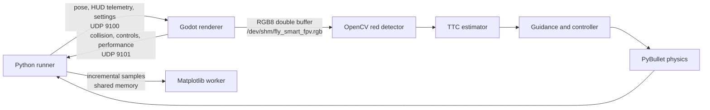

# Simulation loop and Godot data flow

## Responsibilities

Python is the simulation authority. PyBullet owns the drone state, physics,
sensors, flight controller, target detection, TTC estimator, guidance state,
collision outcome, telemetry log, and mission result. Godot is a visual
renderer and operator interface; it does not advance or correct the flight
state.

| Component | Rate | Responsibility |
| --- | ---: | --- |
| PyBullet physics | 240 Hz | Integrate forces, motors, attitude, and position |
| Flight controller | 120 Hz | Update guidance and attitude torque |
| Camera/detector | 30 Hz | Read FPV image, detect the red target, and update TTC |
| Godot FPV capture | 30 Hz target | Render and publish unique RGB frames |
| Live plot worker | 2 Hz | Display accumulated telemetry without blocking flight |

At real-time factor `1.00x`, one 240 Hz physics step represents 4.167 ms of
simulation time and completes every 4.167 ms of wall time on average.

## System flow

The two applications are intentionally loosely coupled. UDP traffic is
nonblocking and Godot drains old pose packets so it renders the latest state.
The camera uses a shared-memory double buffer to avoid encoding images or
sending large UDP packets.

## One Python physics iteration

For each fixed simulation step, the runner performs these operations:

1. Poll interactive Start, Pause, Restart, or Stop commands when enabled.
2. Read the current PyBullet pose and velocity.
3. Sample the synthetic IMU and barometer and update the vertical estimator.
4. On every eighth physics step, perform the 30 Hz camera work:
   - Send the latest drone and target poses to Godot.
   - Copy the stable shared-memory FPV frame and its sequence number.
   - Detect the red target bounding box.
   - Update bbox growth and TTC using the current simulation timestamp.
   - Write the optional 30 FPS video frame.
5. On every second physics step, perform the 120 Hz guidance and attitude
   control update.
6. Convert collective thrust into motor PWM, apply forces and torque, and call
   `PyBullet.stepSimulation()` once.
7. Record flight telemetry and publish one incremental row to the independent
   live-plot process.
8. On camera steps, send HUD telemetry and the detected bbox to Godot.
9. Read Godot collision, operator-control, and renderer-performance events.
10. Wait only for the remaining absolute wall-clock deadline.

No physics steps are skipped. Expensive camera iterations may finish after
their individual 4.167 ms deadline; following inexpensive iterations omit or
shorten their sleep until the absolute schedule is recovered. A stall greater
than 250 ms rebases the deadline instead of causing a long CPU catch-up burst.

## Python to Godot

Python sends compact JSON datagrams to `127.0.0.1:9100`:

- Drone and target positions and quaternions.
- Reset notifications.
- Flight telemetry, bbox, TTC, elapsed wall time, and RTF for the HUD.
- Interactive control-panel enabled/running state.
- Renderer settings, including the authoritative camera capture rate.

PyBullet uses X/Y/Z with Z up. Godot converts this to its X/Y/Z coordinates
with Y up before applying poses. The FPV camera is mounted to the rendered
drone, but its pose ultimately comes from PyBullet.

## Godot camera to Python

Godot renders a 640 x 360 RGB8 FPV image and writes it to
`/dev/shm/fly_smart_fpv.rgb`. The file contains a 32-byte header followed by
two image slots.

For each frame, Godot:

1. Marks the sequence number odd to indicate a write in progress.
2. Writes pixels into the inactive slot.
3. Publishes the new active slot and an even sequence number.

Python reads the header, copies the selected slot, and checks that the sequence
did not change during the copy. An odd or changed sequence is rejected rather
than returning a torn frame. Sequence numbers also reveal new, duplicate,
missing, and skipped frames to the performance profiler.

Godot schedules capture against an absolute 30 Hz deadline after rendered
frames. It captures at most one image per deadline and rebases if it falls more
than one camera interval behind. On the reference system this produces roughly
28--30 unique frames per second while the Python camera loop polls at 30 Hz.

## Godot to Python events

Godot sends small JSON events to `127.0.0.1:9101`:

- `collision`: target contact completes the strike; an obstacle aborts it.
- `control`: Start, Pause, Restart, and Stop commands from the Godot toolbar.
- `performance`: FPS, process time, capture rate, deadline status, image
  readback time, shared-memory write time, objects, and draw calls.

Python drains and routes every event type so a performance packet cannot hide
a collision or operator command.

## Reset, pause, and shutdown

Restart resets PyBullet state, sensors, estimators, guidance, TTC history,
telemetry, collision state, plot generation, camera settings, and the pacing
deadline. Pause stops physics advancement and rebases pacing on resume; it does
not attempt to simulate the time spent waiting. Stop saves partial run outputs
and closes the bridge, video writer, plot worker, and shared-memory resources.

The saved telemetry CSV remains the authoritative full-rate record. The live
plot receives only chart-required fields through a separate shared-memory
matrix and cannot block the flight loop.
